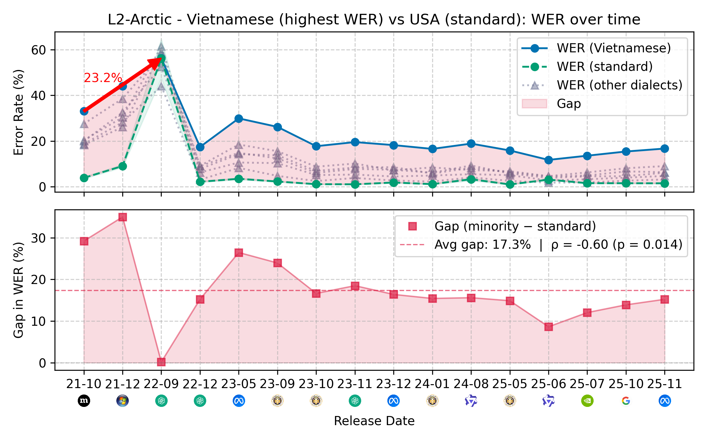
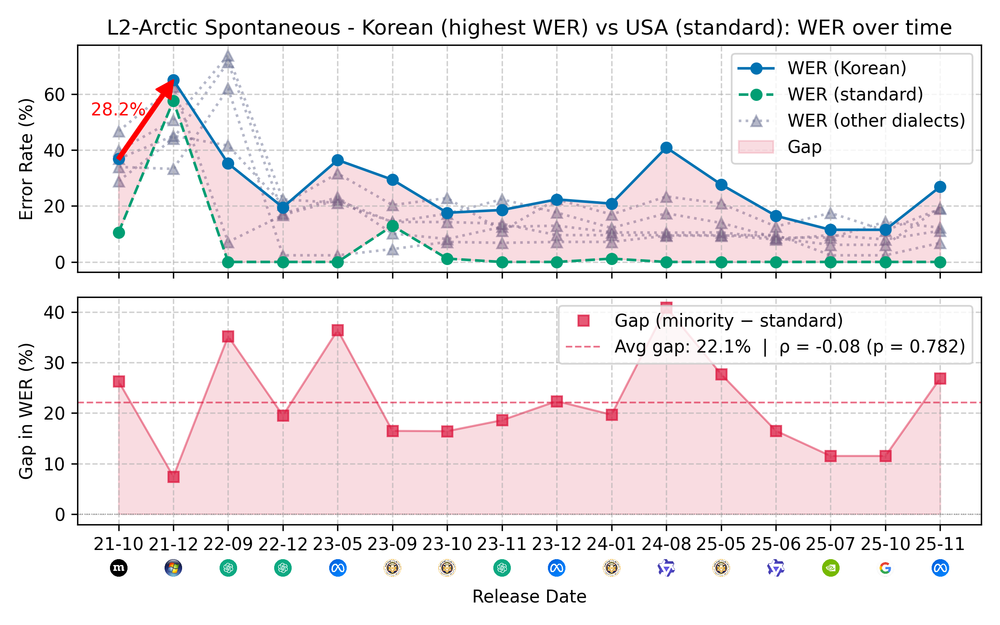
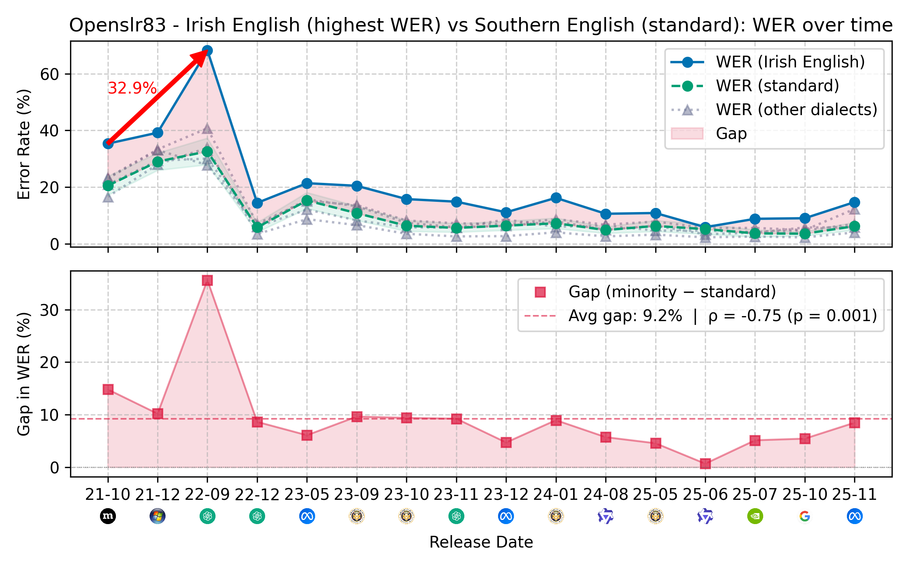
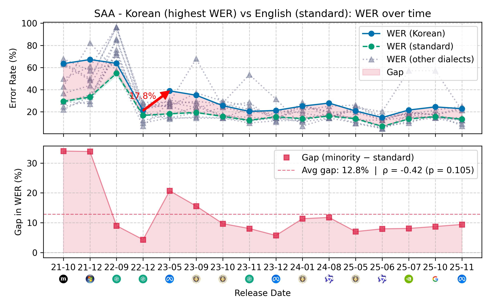
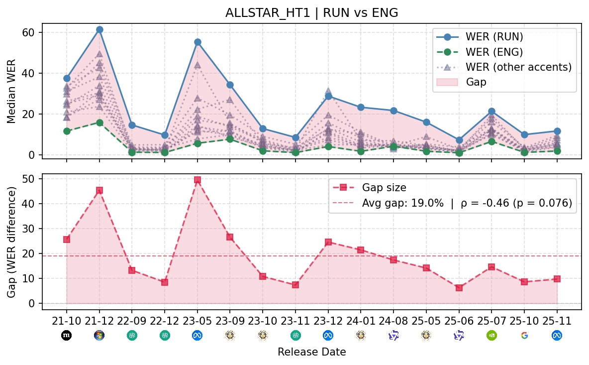
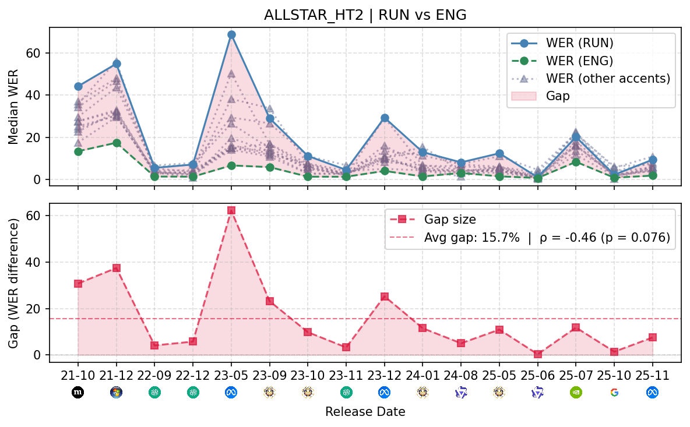
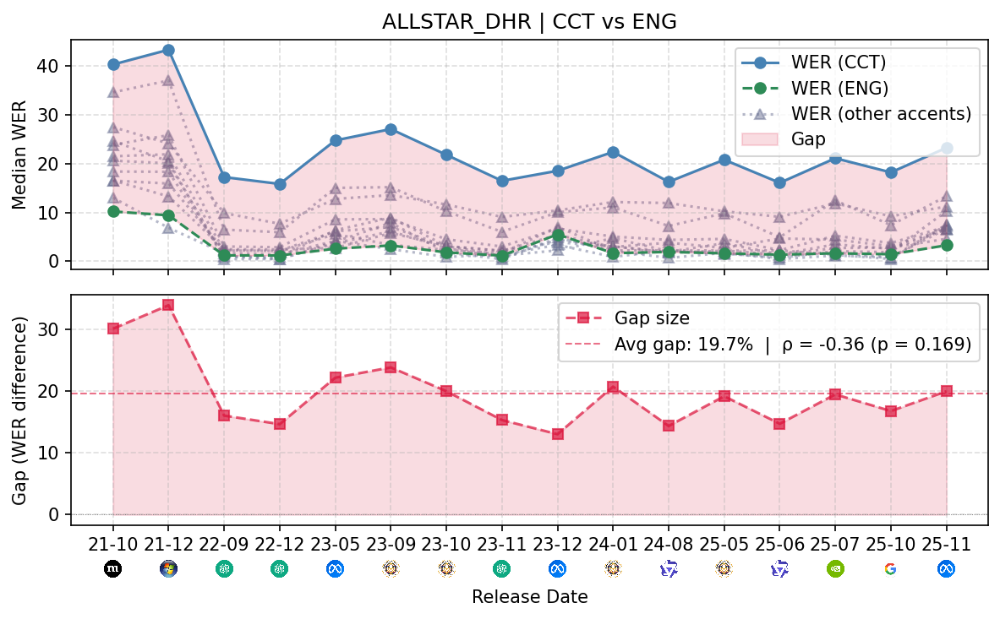
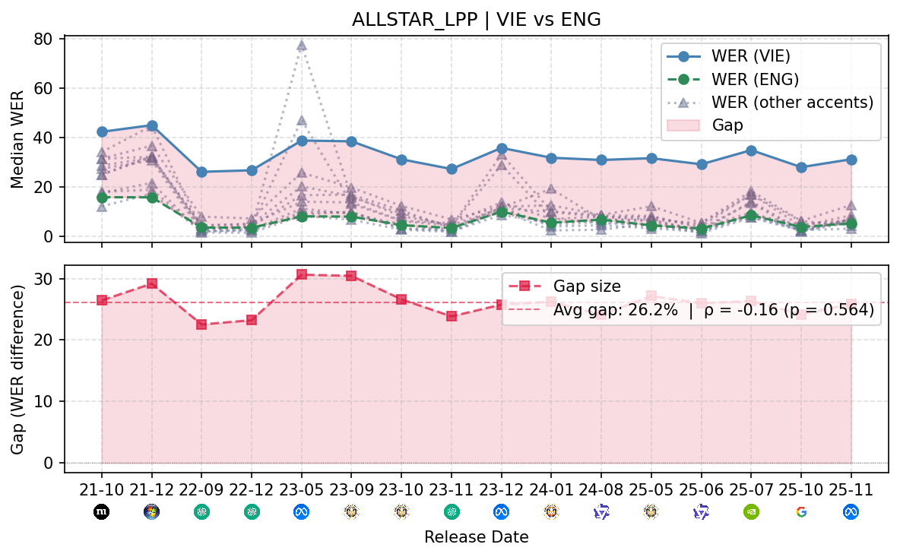

# Connecting the Dots

Code for *Connecting the Dots: Enduring Performance Gaps in ASR Systems Between Standard and Minority English Varieties*.

Includes dataset preparation, 16 model configurations, WER/CER scoring, longitudinal plots, and degradation analysis.

<p>
  
  <br>
  
  <br>
  
  <br>
  
  
</p>

Word error rates and standard–minority accent gaps across eight datasets.

## Setup

```sh
python3 -m venv .venv
source .venv/bin/activate
pip install -c requirements.txt -e '.[dev]'
asr-eval demo --output outputs/demo
pytest
```

Python 3.10+. The demo uses synthetic audio and saved predictions; it requires no model downloads.

## Experiments

[Prepare the datasets](docs/data.md), then install the relevant [model dependencies](docs/models.md).

```sh
asr-eval run data/manifests/all.jsonl --config configs/paper.json \
  --model whisper-v3 --output outputs/whisper-v3
asr-eval analyze --scores outputs/*/scores.csv --config configs/paper.json \
  --output outputs/analysis
```

`prepare` writes JSONL manifests containing audio paths, transcripts, accents, and segment boundaries. Reuse the same manifest for every model. `run` selects a model by `id`, loads its backend and checkpoint, transcribes each sample, and writes predictions and WER/CER to `scores.csv`. `run.json` records configuration and input, code, and environment hashes; rerunning skips completed samples when these match.

[configs/paper.json](configs/paper.json) defines model IDs, names, release dates, backends, checkpoints, decoding options, and analysis settings (accent groups, model pairs, and bootstrap sampling). To change a checkpoint, copy the config, edit the model entry, and pass `--config` with a new output directory. Run each model separately, then pass their score files and the same config to `analyze` to produce figures and tables. Analysis expects all configured models; use `--allow-partial` for a smaller run. See [analysis details](docs/analysis.md).

## Layout

```text
configs/          Model and analysis settings
longitudinal_asr/  Data loaders, model adapters, runner, scoring, and analysis
data/             Sample selections, references, and local corpora/manifests
docs/             Data and model instructions, analysis methods, paper figures
tests/            Loader, runner, model, and statistical checks
outputs/          Local predictions, run metadata, figures, and tables
```

## Citation

```bibtex
@misc{metzger2026connecting,
  title = {Connecting the Dots: Enduring Performance Gaps in ASR Systems Between Standard and Minority English Varieties},
  author = {Metzger, Alexander and Srivastava, Aruna and Mukhamedvaleev, Ruslan and Yeo, Eunjung and Ahmed, Syed Ishtiaque and Markl, Nina and Kumar, Sachin and Samir, Farhan},
  year = {2026},
  url = {https://github.com/smfsamir/longitudinal-asr-eval}
}
```

## Source attribution

Adapted from [KoelLabs/ML](https://github.com/KoelLabs/ML). See [source attribution](THIRD_PARTY_NOTICES.md) and the [AGPL v3 license](LICENSE).
